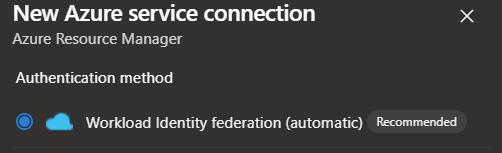

# Festive Tech Calendar 2023

## Overview
This repository contains the source code for the session I presented at the Festive Tech Calendar 2023. The session covered various aspects of how to deploy Self-Hosted Azure DevOps Agent with Container App Jobs within Azure Container App Environment.

## Session
[](https://youtu.be/rfe2lVtctC4?si=OmfQFOPneVCVm2_t)


## Prerequisites
Some Pre-requisites that needs to be in tact before running the bicep deployment.

- Make sure that you have an Azure Subscription.
- Make sure that you have an Azure DevOps Organization that is connected to your Azure Subscription.
- Make sure you have the appropiate permissions to create resources in your subscription, `Owner` or relevant RBAC permissions are needed due to Role Assignments, as `contributor` role cannot assign roles to other resources.
- Make sure that the latest version of Azure PowerShell is installed and user is signed in with permission to create container app environments etc
- Make sure that the latest bicep version is installed as well.


Use the following commands to install the latest version of Azure PowerShell and bicep.
```powershell
Install-Module -Name Az -AllowClobber -Scope CurrentUser -Force
```

It's also good to register the following providers in your subscription, as they are used in the deployment.
```powershell
az provider register --namespace Microsoft.ContainerRegistry
az provider register --namespace Microsoft.KeyVault
```


## Setup
To set up the project, follow these steps:
1. Clone the repository.

### Azure DevOps
1. Azure DevOps - Create A Personal Access Token with `Agent Pools (read, manage)` scope and choose how long you want the token to be valid for and remember to save the token for later use, as it will not be shown again.
   > **_IMPORTANT:_** The PAT token is needed for the KEDA azure-pipline scaler as it doesn't support Managed Identity yet, the PAT token will be added to Key Vault during the deployment and referenced in the KEDA Scaler configuration. <br>

2. In Azure DevOps - Create a Self-hosted Agent pool at Organization Level and copy the pool name for later use.

### Code Repository
1. Modify the `.bicepparams` files with your own values for the parameters. - It's important that you add the correct pool name and PAT token in the `iac/bicep/agent-infrastrucutre/main.bicepparam` file, otherwise the deployment will fail.

## Running the scripts and code to deploy the environment.
To run the project, follow these steps:
1. Run the 'bicep-deploy.ps1' with the following command to create the pre-requisite resources first.
    ```powershell
    $preReqDeployment = @{
        adoResourceGroupName = "cnappenv-ado-rg"
        adoUserAssignedIdentityName = "cnappenv-ado-mi"
        tfResourceGroupName = "tf-infra-env-rg"
        tfUserAssignedIdentityName = "tf-infra-env-mi"
        location = "westeurope"
        subscriptionId = "<REPLACE WITH YOUR SUBSCRIPTION ID>" # Replace with your subscription ID
        tenantId = "<REPLACE WITH YOUR TENANT ID>" # Replace with your tenant ID
        runOnlyPreReq = $true
    }

    .\.powershell\bicep-deploy.ps1 @preReqDeployment

    ```
2. Add the `adoUserAssignedIdentity` that you created with the script to `[YourAzureDevOpsOrganization]\Project Collection Service Accounts` group in Azure DevOps. This is needed so the deployment scripts and the container app can add the agent to the Azure DevOps Agent Pool, if you don't do this, the deploymentscripts for the placeholderagent and the agentjobs will fail.<br>
    
    > **_Note:_** The identity can be added to the `Project Collection Servcie Accounts` DevOps Group after the bicep deployment, but just remember to run the `placeholderagent` deployment script again so it will create the placeholder agent in Azure DevOps. <br>

3. Run the 'bicep-deploy.ps1' to create the container app environment and the terraform test environment.
    ```powershell
    $environmentParameters = @{
        adoResourceGroupName = "cnappenv-ado-rg"
        adoUserAssignedIdentityName = "cnappenv-ado-mi"
        tfResourceGroupName = "tf-infra-env-rg"
        tfUserAssignedIdentityName = "tf-infra-env-mi"
        location = "westeurope"   
        subscriptionId = "<REPLACE WITH YOUR SUBSCRIPTION ID>" # Replace with your subscription ID
        tenantId = "<REPLACE WITH YOUR TENANT ID>" # Replace with your tenant ID
    }
    
    .\.powershell\bicep-deploy.ps1 @environmentParameters
    ```

## Testing the environment
To test the environment, follow these steps:

### Setup the Environment

#### Azure DevOps
1. Go to your Azure DevOps Organization and create a project.
2. Navigate to the project and clone this repository into your new project.
3. Create a Service Connection to your Azure Subscription, I recommend using the New Workload Identity federation feature, as it's more secure than using a Service Principal.

    

4. Under Pipelines - Environment - Create a new environment called `terraform`.
5. Create two pipelines from existing files within the repository and give it appropriate names.
    - One pipeline for scale testing: `.ado\azure-pipelines\azure-pipelines-scale-test.yml` rename it to for example `scale-test`.
    - One pipeline for the terraform test: `.ado\azure-pipelines\azure-pipelines-tf-test.yml` rename it to for example `terraform-test`.
6. Modify the pipelines to use the correct agent pool and service connection.
7. Under Pipelines - Library - Create a Variable Group called `terraform` with the following values: <br>
        
| Name | Value    | Description |
| ---- | -------- | ----------- |
| container_name | `terraform-state` | The name of the container where the terraform state file will be stored. |
| key_name | `terraform.tfstate` | The name of the terraform state file. |
| resource_group_name | `Name of the resouce group that was created during the bicep deployment` | The name of the resource group where the terraform state file will be stored. |
| storage_account_name | `Name of the storage account that was created during the bicep deployment` | The name of the storage account where the terraform state file will be stored. |
| tfversion | `latest`  | The version of terraform that will be used in the pipeline. |
| userAzureADAuth | `true` | Entra ID authentication will be used to authenticate to the Storage Account. |

#### Azure
1. Go to your Azure Subscription and make sure to give your newly created Identity `Storage Blob Data Owner` role on the storage account that was created by the bicep deployment.

### Running the tests

#### Scaling test.
1. Run the `scale-test` pipeline and make sure that it succeeds, you can run it multiple times to see that the agent pool scales up, just remember you need to have more then one license for parralel jobs in your Azure DevOps organization, for the agent pool to scale up, otherwise it will only be able to run one job at a time.
2. You might get a prompt for allowing access to use the agent pool, environment etc, click permit and continue.

#### Terraform test.
1. Run the `terraform-test` pipeline.
2. You might get a prompt for allowing access to use the agent pool, environment etc, click permit and continue.
3. The pipeline will run required terraform pre-requisites such as `terraform init`, `terraform plan` etc.
4. After running the first stage it will wait for manual appoval, then run the `terraform apply` wich will create a resource group defined in the terraform code.

## Cleanup
To clean up the project, follow these steps:
1. Delete the Resource Group created by the Terraform test pipeline.
2. Delete the Azure DevOps Project.
3. Delete the Azure DevOps Agent Pool.
4. Remove the managed identity from the `Project Collection Service Accounts` group in Azure DevOps.
5. Run the `bicep-deploy.ps1` with the following command to delete the resources that were created by pre-requisite deployment.
    
    ```powershell
    $cleanUpParameters = @{
        adoResourceGroupName = "ftechcal2023-ado-rg"
        tfResourceGroupName = "ftechcal2023-tf-rg"
        location = "westeurope"
        subscriptionId = "<REPLACE WITH YOUR SUBSCRIPTION ID>" # Replace with your subscription ID
        tenantId = "<REPLACE WITH YOUR TENANT ID>" # Replace with your tenant ID
        cleanup = $true
    }
    
    .\.powershell\bicep-deploy.ps1 @cleanUpParameters
    ```

## Author
Originally created by [Haflidi Fridthjofsson](https://www.github.com/haflidif)
